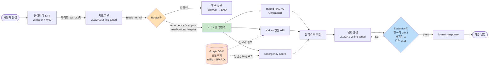

# Agent Design Patterns — LG HelloDoctor 적용

> 출처: Anthropic — *Building effective agents* (2024)
> https://www.anthropic.com/engineering/building-effective-agents

이 문서는 Anthropic이 제안한 5가지 에이전트 워크플로 패턴을 LG HelloDoctor 코드베이스의 어느 부분에 어떻게 적용했는지를 정리한다.

---

## 1. 적용 매핑 한눈에 보기

| # | 패턴 | LG HelloDoctor 적용 위치 | 핵심 코드 |
|---|---|---|---|
| ① | **Prompt Chaining** | A(STT) → B(Intent) → C(RAG/Hospital) → D(Answer) 순차 체인 + 게이트 | `backend/agent_patterns.py::PromptChain`, `gate_*` |
| ② | **Routing** | 의도 분류 결과로 RAG/Hospital/Emergency 분기 | `backend/main.py::tool_router`, `agent_patterns.py::IntentRouter` |
| ③ | **Parallelization** | RAG · Kakao 병원 검색 · Emergency 체크를 동시에 호출 | `agent_patterns.py::run_c_team_parallel` (ThreadPoolExecutor) |
| ④ | **Orchestrator-Worker** | A/B/C/D 워커를 조율하는 **LangGraph StateGraph** | `backend/graph_pipeline.py::build_graph`, `agent_patterns.py::PipelineOrchestrator` |
| ⑤ | **Evaluator-Optimizer** | D팀 답변을 한국어 비율·금지어·길이로 평가 → 실패 시 최대 2회 재생성 | `agent_patterns.py::AnswerEvaluator`, `generate_with_evaluator` |

---

## 2. 전체 파이프라인 다이어그램



전체 그래프는 **LangGraph StateGraph**(`backend/graph_pipeline.py`)로 오케스트레이션된다(④). 체이닝(①)은 전체 흐름, 라우팅(②)·병렬(③)·평가-최적화(⑤)는 색칠된 노드, Graph DB(⑥)는 온톨로지 SPARQL로 응급 점수·진료과를 보강한다(`ontology_store.py`).

---

## 3. 패턴별 상세

### ① Prompt Chaining

**적용 의도**: 음성 한 줄 → 의도 → 도구 결과 → 답변 까지 여러 LLM 호출이 단계적으로 누적된다. 각 단계는 다음 단계의 입력 정확도를 좌우하므로 **단계별 게이트(gate)** 로 조기 종료한다.

```python
# backend/agent_patterns.py
gate_stt_to_intent(stt_out)    # A→B: STT 텍스트 ≥ 2자
gate_intent_to_tools(b_out)    # B→C: ready_for_c=True (다중턴 중이 아님)
```

`PromptChain` 클래스로 step 리스트를 받아 게이트 실패 시 `state["halted_at"]` 에 단계명을 기록하고 종료한다.

### ② Routing

**적용 의도**: 의도(intent)에 따라 필요한 도구가 다르다. medication_info는 병원 검색 불필요, hospital_search는 RAG 불필요. 분류기가 라우터 역할을 한다.

```python
# backend/main.py::tool_router
intent = output_from_B.get("intent")
# parallel은 intent별로 필요한 작업만 ThreadPool에 제출
needs_rag      = intent in ("symptom_inquiry", "medication_info")
needs_hospital = intent in ("symptom_inquiry", "hospital_search")
```

`IntentRouter` 클래스는 핸들러 등록형 추상화 — 향후 의도가 추가될 때 `router.register("new_intent", handler)` 한 줄로 확장 가능.

### ③ Parallelization

**적용 의도**: C팀의 3개 호출(RAG · Kakao · Emergency)은 서로 독립적이고 모두 네트워크 I/O 위주다. 직렬로 호출하면 합산 지연이 누적된다.

```python
# backend/agent_patterns.py::run_c_team_parallel
with ThreadPoolExecutor(max_workers=3) as pool:
    futures = {"emergency": pool.submit(emergency_fn, query)}
    if needs_rag:      futures["rag"]      = pool.submit(rag_fn, query)
    if needs_hospital: futures["hospital"] = pool.submit(hospital_fn, query, lat, lng)
```

**효과**: 직렬 대비 약 1.5~2x 응답 단축 (RAG ~600ms + Kakao ~300ms + Emergency ~10ms → max(~600ms)).

### ④ Orchestrator-Worker

**적용 의도**: A/B/C/D 워커는 각자 다른 모델·툴을 쓰고 책임 영역이 명확하다. 중앙 오케스트레이터는 라우팅 결정·게이트 검증·컨텍스트 조립만 담당하고, 실제 LLM/도구 호출은 워커에 위임한다.

```python
# backend/agent_patterns.py::PipelineOrchestrator
workers = PipelineWorkers(
    stt=stt_pipeline,
    chat_followup=chat_with_followup,
    tool_router=tool_router,
    answer_generator=generate_answer,
    formatter=format_response,
)
orch = PipelineOrchestrator(workers, evaluator=AnswerEvaluator(FORBIDDEN_WORDS))
result = orch.run(raw_text, session_id, lat, lng)
```

현재 진입점은 `backend/main.py::full_pipeline` → **LangGraph StateGraph**(`graph_pipeline.py::build_graph`)에 위임한다. 그래프 구조:

```
START → stt → intent ─┬─(다중턴: ready_for_c=False)→ followup → END
                      └─(ready_for_c=True)──────────→ tools → answer → END
```

워커(stt/chat_followup/tool_router/answer_generator/formatter)는 `PipelineWorkers`로 주입(DI)되므로 그래프는 langchain/모델 의존성 없이 단독 테스트 가능(`tests/test_graph_pipeline.py`). `PipelineOrchestrator`(함수형 클래스 버전)도 동일 책임으로 유지 — 비교·폴백용.

> **Graph DB(⑥) 연계**: `tool_router` 내부 `emergency_check`·`search_hospital`은 코드 dict 와 함께 `ontology_store`(rdflib SPARQL)를 호출한다. 응급 점수는 dict·온톨로지 중 높은 값 채택, 진료과는 dict 미매칭 시 온톨로지로 폴백. 추이추론(partOf*)은 `GET /ontology/body-parts/{region}`로 노출 (`tests/test_ontology_store.py`).

### ⑤ Evaluator-Optimizer

**적용 의도**: 파인튜닝 LLaMA 3.2가 가끔 영어 단어를 섞거나 너무 짧게 답하는 케이스를 자동 보정한다. 평가자가 실패하면 같은 프롬프트로 재생성(최대 2회).

```python
# backend/agent_patterns.py::AnswerEvaluator
KOREAN_RATIO_THRESHOLD = 0.4
MIN_LENGTH = 15
# evaluate(answer) → EvalReport(passed, score, issues)
```

**HITL 거버넌스 연결**: `FORBIDDEN_WORDS`(의료법 위반 차단)는 법률·컴플라이언스 자문단이 큐레이션. 평가자는 이 리스트를 단순 검출만 하고, 추가/삭제는 사람이 PR로 한다. AI가 단독 결정하지 않는다 → CLAUDE.md HITL 3-Tier 매트릭스 #5 항목.

```python
result = generate_with_evaluator(
    generator=lambda: generate_answer(text, context=..., entities=...),
    evaluator=evaluator,
    max_retries=2,
)
# result["attempts"], ["eval_passed"], ["eval_issues"], ["eval_score"]
```

응답에 `eval` 메타가 포함되므로 LangSmith 트레이스나 향후 대시보드에서 재시도율을 모니터링 가능.

---

## 4. 패턴 ↔ HITL 거버넌스 매트릭스

| 패턴 | 자동화 영역 | 사람 검수 영역 |
|---|---|---|
| ① Chaining | 게이트 자동 검증 | 게이트 임계값(2자 등) 변경은 PR |
| ② Routing | 의도→핸들러 자동 분기 | 신규 의도 추가는 의사+개발팀 합의 |
| ③ Parallelization | 동시 호출 | max_workers·timeout 튜닝은 개발팀 |
| ④ Orchestrator | 흐름 조율 | 신규 워커 도입은 아키텍처 리뷰 |
| ⑤ Evaluator | 한국어/금지어/길이 자동 평가·재생성 | 금지어 큐레이션은 법률·컴플라이언스, 임계값(0.4·15자)은 노년학 자문 |

---

## 5. 참고

- 원문: <https://www.anthropic.com/engineering/building-effective-agents>
- 본 프로젝트 HITL 거버넌스: [HITL_3TIER.md](./HITL_3TIER.md)
- 백엔드 지침: [.github/instructions/backend.instructions.md](../.github/instructions/backend.instructions.md)
- 기술 리포트: [technical-report.md](./technical-report.md)
