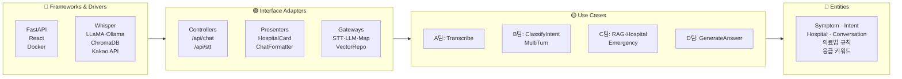

# LG HelloDoctor — Clean Architecture

Robert C. Martin 의 Clean Architecture 4계층을 시니어 음성 의료 AI 서비스에 매핑.
가장 안쪽은 **변하지 않는 의료 도메인 규칙**, 가장 바깥은 **언제든 교체 가능한 프레임워크** 입니다.

> ✅ **구현 상태 (2026-05): 4계층 물리 분리 완료**
> `backend/domain/` (Entities·Rules·Ports) · `backend/usecases/` (LangGraph·5패턴 파사드 + 병원탐색·RAG 전략) ·
> `backend/adapters/` (Presenters) · `backend/infra/` (Graph DB·Kakao MapGateway).
> 검증: `tests/test_domain.py`·`test_usecases.py` 등 **순수 계층 84개 테스트** · 의존 방향 안→밖 단방향.
> main.py 는 상수·규칙을 정의하지 않고 domain 을 import 해 재노출(re-export)하며, 모델 핸들을 유스케이스에
> 주입하는 **합성 루트(composition root)** 역할만 한다 (기존 호출부·테스트 100% 호환).

## 핵심 원칙 — 의존성 규칙 (Dependency Rule)

> **소스 코드 의존성은 안쪽으로만 향한다.**
> 안쪽 계층은 바깥쪽 계층의 이름·구조·API 를 절대 참조하지 않는다.

- Entities 는 FastAPI / ChromaDB / Ollama 의 존재를 모른다.
- Use Cases 는 Whisper 가 어떤 모델인지, RAG 가 어떤 DB 를 쓰는지 모른다.
- 외부 시스템 교체(Kakao → Naver, Ollama → vLLM, ChromaDB → Pinecone)가 안쪽 코드 수정 없이 가능해야 한다.

이는 **Dependency Inversion** 으로 달성 — 안쪽이 추상 인터페이스를 정의하고, 바깥쪽이 그걸 구현.

---

## 동심원 4계층 — 시각화

```
                     ╔═══════════════════════════════════════════════╗
                     ║   Frameworks & Drivers (외부 — 언제든 교체)    ║
                     ║   FastAPI · React · Docker · ChromaDB        ║
                     ║   Whisper · LLaMA(Ollama) · Kakao API · Groq  ║
                     ║   ┌─────────────────────────────────────────┐ ║
                     ║   │  Interface Adapters (어댑터·번역)        │ ║
                     ║   │  Controllers · Presenters · Gateways    │ ║
                     ║   │  Repositories · DTO 변환                 │ ║
                     ║   │  ┌───────────────────────────────────┐  │ ║
                     ║   │  │  Use Cases (애플리케이션 흐름)     │  │ ║
                     ║   │  │  A팀 STT → B팀 의도 → C팀 RAG     │  │ ║
                     ║   │  │     → D팀 답변 생성               │  │ ║
                     ║   │  │  ┌─────────────────────────────┐  │  │ ║
                     ║   │  │  │  Entities (도메인 핵심)      │  │  │ ║
                     ║   │  │  │  Symptom · Hospital · Intent │  │  │ ║
                     ║   │  │  │  Conversation · Emergency    │  │  │ ║
                     ║   │  │  │  의료법·시니어 친화 규칙     │  │  │ ║
                     ║   │  │  └─────────────────────────────┘  │  │ ║
                     ║   │  └───────────────────────────────────┘  │ ║
                     ║   └─────────────────────────────────────────┘ ║
                     ╚═══════════════════════════════════════════════╝
                            ↑                          ↓
                     화살표는 의존성 방향: 항상 안쪽으로만
```

PowerPoint/Figma 로 옮길 때:
- **중앙(연한 노랑)**: Entities — 가장 진한 핵심 색
- **2번째 링(연한 초록)**: Use Cases
- **3번째 링(연한 파랑)**: Interface Adapters
- **바깥 링(연한 회색)**: Frameworks & Drivers
- 각 링 안의 컴포넌트는 **격자형 또는 부채꼴 분할**로 4팀(A/B/C/D) 나눠 배치 가능

---

## 1️⃣ Entities — 도메인 핵심 (가장 안쪽)

> "외부 시스템이 사라져도 살아남는 의료 도메인 그 자체"

### 도메인 모델

| 엔티티 | 의미 | 속성 예시 |
|---|---|---|
| `Symptom` | 증상 | 부위, 강도, 지속시간, 동반증상 |
| `Intent` | 발화 의도 | `emergency` / `symptom_inquiry` / `medication_inquiry` / `hospital_search` / `general_chat` |
| `Hospital` | 병원 | 이름, 진료과, 좌표, 진료시간, 거리 |
| `Conversation` | 대화 세션 | 발화 이력, 다중턴 컨텍스트, 사용자 프로필 |
| `MedicalKnowledge` | 의료 지식 청크 | text, doc_id, source(KDCA), embedding |
| `Emergency` | 응급 판단 | severity, 권고 행동(119) |

### 비즈니스 규칙 (외부 라이브러리 X)

- **의료법 준수**: `FORBIDDEN_WORDS` (단정적 진단·처방 금지 — "치료해드릴게요" 절대 금지)
- **응급 키워드 정책**: 쓰러짐, 의식소실, 흉통, 호흡곤란 등 → 즉시 119 안내
- **진료과명 보정**: `MEDICAL_CORRECTIONS` ("안과가" → "안과")
- **시니어 친화 규칙**: 한국어 존댓말, 1~3문장, 어려운 용어 풀어쓰기, 권유형 어조

> 📁 **코드 위치 (구현 완료):** `backend/domain/entities.py` (dataclasses Intent·Symptom·Hospital·Emergency·MedicalKnowledge·Conversation) + `backend/domain/rules.py` (FORBIDDEN_WORDS·EMERGENCY_*·MEDICAL_CORRECTIONS·SYMPTOM_DEPT_MAP + 순수 함수 `preprocess_text·score_emergency·classify_emergency·lookup_department·query_rewrite·filter_forbidden·contains_emergency_keyword`). 외부 라이브러리 0개(표준 `re`만 사용). HITL 책임자 주석 동거.

---

## 2️⃣ Use Cases — 애플리케이션 비즈니스 규칙

> "사용자가 시스템으로 무엇을 하는가 — A→B→C→D 파이프라인"

### LG HelloDoctor 의 4팀 매핑

| 팀 | Use Case | 입력 → 출력 | 의존(추상) |
|---|---|---|---|
| **A팀** | `TranscribeUserAudio` | 음성 bytes → text | `STTGateway` |
| **B팀** | `ClassifyIntent` | text + 이력 → `Intent` | `LLMGateway` |
| **B팀** | `ManageMultiTurnContext` | 이력 누적/clear | `ConversationRepository` |
| **C팀** | `SearchMedicalKnowledge` | query → `[MedicalKnowledge]` | `VectorRepository`, `LLMGateway`(HyDE) |
| **C팀** | `FindNearbyHospital` | 진료과 + 위치 → `[Hospital]` | `MapGateway` |
| **C팀** | `DetectEmergency` | 발화 → `Emergency` | (Entities 의 응급 키워드 규칙) |
| **D팀** | `GenerateSeniorFriendlyAnswer` | query + context + intent → text | `LLMGateway` |

### 흐름 (한 발화의 생명주기)

```
사용자 발화(음성)
   ↓ TranscribeUserAudio
text
   ↓ ClassifyIntent (+ ManageMultiTurnContext)
Intent
   ↓ DetectEmergency  ──→ 응급이면 바로 119 안내 답변
정상 발화
   ↓ SearchMedicalKnowledge / FindNearbyHospital
context + sources
   ↓ GenerateSeniorFriendlyAnswer
시니어 친화 답변(text + 병원 카드)
```

> 📁 **코드 위치 (구현 완료):** `backend/usecases/` — LangGraph 그래프(`graph_pipeline.py`)+5패턴(`agent_patterns.py`) 파사드에 더해 **순수 유스케이스를 실제 추출**했다: `usecases/hospital.py::find_nearby_hospital`(MapGateway·OntologyGateway를 인자로 주입), `usecases/rag.py::rrf_fuse`·`select_confident`(Hybrid RAG 검색 전략, 모델 의존 0). `main.full_rag_pipeline`·`search_hospital` 은 이 유스케이스에 infra(Kakao·ChromaDB·reranker)를 주입하는 합성 어댑터로 축소됐다. 워커는 `PipelineWorkers` DI 로 주입되어 **의존성 역전(Dependency Inversion)** 을 구현.

---

## 3️⃣ Interface Adapters — 어댑터 (번역 계층)

> "Use Case 와 외부 세계 사이의 통역사"

### Controllers (HTTP / WebSocket → Use Case 호출)

| 어댑터 | 역할 | 위치 |
|---|---|---|
| `POST /api/stt` | 음성 업로드 → `TranscribeUserAudio` 호출 | `backend/main.py` |
| `POST /api/chat` | text + 이력 → 전체 파이프라인 호출 | `backend/main.py` |
| WebSocket(예정) | 실시간 스트리밍 STT | — |

### Presenters (Use Case 결과 → 클라이언트 포맷)

| 어댑터 | 역할 |
|---|---|
| `ChatResponseFormatter` | text + 출처 + 응급여부 → JSON |
| `HospitalCardPresenter` | `Hospital` → 카드 UI JSON (이름/거리/진료시간/전화) |
| `ServiceDisclaimerInjector` | 모든 답변에 "참고용 / 진료는 병원에서" 면책 추가 |

### Gateway 인터페이스 (Use Case 가 호출하는 추상)

| 인터페이스 | 추상 메서드 |
|---|---|
| `STTGateway` | `transcribe(audio_bytes) -> str` |
| `LLMGateway` | `generate(prompt, **opts) -> str` |
| `VectorRepository` | `search(query, top_k) -> [Knowledge]` |
| `MapGateway` | `nearby(category, lat, lng) -> [Hospital]` |
| `ConversationRepository` | `load(session_id) / save(...)` |

### Frontend 측

| 어댑터 | 역할 | 위치 |
|---|---|---|
| `useMedicalChat` | API 호출 + 상태 관리 | `frontend/src/hooks/` |
| `useVoiceInput` | 마이크 + 녹음 → blob | `frontend/src/hooks/` |
| `useWakeWord` | 호출어 감지 | `frontend/src/hooks/` |
| `ChatCard`/`HospitalCard` | View 컴포넌트 | `frontend/src/components/chat/` |

> 📁 **코드 위치 (부분 완료):** Presenters는 `backend/adapters/presenters.py` (`format_response`·`format_hospital_text`)로 추출. Gateway 인터페이스(Protocol)는 `backend/domain/ports.py`에서 `STTGateway·LLMGateway·VectorRepository·MapGateway·OntologyGateway·ConversationRepository` 로 정의. Controllers(FastAPI 라우트)와 외부 호출 어댑터 구현체는 아직 `backend/main.py` 합성 루트에 동거.

---

## 4️⃣ Frameworks & Drivers — 외부 (가장 바깥)

> "오늘 선택한 도구. 내일 바뀌어도 안쪽 코드는 그대로"

### Web / UI

| 도구 | 역할 |
|---|---|
| **FastAPI + Uvicorn** | HTTP 서버 |
| **React + Vite** | SPA 프론트엔드 |
| **nginx** | 정적 파일 + reverse proxy |

### ML / AI

| 도구 | 사용처 (팀) |
|---|---|
| **Whisper-small** + Silero VAD | A팀 STT |
| **LLaMA 3.2-3B (Ollama)** | B팀 의도 분류, D팀 답변 생성 |
| **Gemma-3-4B (LoRA)** | (실험) 답변 fine-tune |
| **Sentence-Transformers** `jhgan/ko-sroberta-multitask` | C팀 임베딩 |
| **CrossEncoder** `Dongjin-kr/ko-reranker` | C팀 reranker |
| **rank_bm25** | C팀 keyword retrieval |

### 데이터 / 외부 API

| 도구 | 역할 |
|---|---|
| **ChromaDB** | 의료 지식 vector store |
| **Kakao Map API** | C팀 병원 위치 검색 |
| **Groq API** | (eval) Judge LLM, 합성 데이터 생성 |
| **LangSmith** | 추적·평가 UI |

### DevOps / 빌드

| 도구 | 역할 |
|---|---|
| **Docker / docker-compose** | 컨테이너 오케스트레이션 |
| **pytest** | 백엔드 테스트 |
| **npm / Vite build** | 프론트엔드 빌드 |

> 📁 코드 위치: `Dockerfile`, `docker-compose.yml`, `requirements.txt`, `package.json`.

---

## 의존성 흐름 — "원을 가로지르는 데이터"

한 사용자 발화가 동심원을 안→밖→안 으로 통과하는 과정:

```
[외부] 사용자가 마이크에 말함
  ↓ (드라이버: 브라우저 MediaRecorder)
[Frameworks] React useVoiceInput → POST /api/stt (FastAPI)
  ↓
[Adapters] STT Controller → STTGateway 인터페이스 호출
  ↓
[Use Cases] TranscribeUserAudio.execute(audio)
  ↓ ↑ (Whisper 호출은 STTGateway 구현체가 담당)
[Adapters] WhisperAdapter — 실제 라이브러리 호출
  ↓
[Frameworks] openai-whisper / transformers
  ↓ (audio → text 결과)
[Use Cases] text 받음 → ClassifyIntent → ...
  ↓
[Entities] Intent 객체 생성 (5분류 규칙)
  ↓
[Use Cases] SearchMedicalKnowledge / GenerateSeniorFriendlyAnswer
  ↓
[Adapters] ChatResponseFormatter
  ↓
[Frameworks] FastAPI Response → React 렌더
  ↓
[외부] 사용자 화면에 답변 + 병원 카드
```

**핵심**: Use Cases 는 "Whisper" 라는 단어를 모릅니다. `STTGateway.transcribe()` 만 호출하고, 그 구현이 Whisper 든 Naver Clova 든 OpenAI Whisper API 든 무관.

---

## 도식화 가이드 — 동심원 그릴 때

### 부채꼴 분할 권장

원을 4분면으로 쪼개서 **A/B/C/D 팀** 영역을 표시하면 정보 밀도가 높아집니다:

```
        A팀 (STT)
       │   │
       │   │
─────  ●  ─────   ← 동심원 4겹
       │   │      ← 각 겹마다 4팀이 차지하는 부채꼴
       │   │
        D팀 (답변)        B팀 (의도)
                  C팀 (RAG)
```

### 색상 가이드

| 계층 | 추천 색 (LG HelloDoctor 브랜드 톤) | 의미 |
|---|---|---|
| Entities | LG 시그니처 레드 (#A50034) — 가장 진하게 | 핵심 가치 |
| Use Cases | 톤 다운 레드/오렌지 | 비즈니스 흐름 |
| Adapters | 중성 그레이 | 번역 계층 |
| Frameworks | 연한 그레이/화이트 | 교체 가능 |

### 화살표

- 모든 의존성 화살표는 **밖 → 안** 방향만 그리기 (역방향 절대 금지)
- 데이터 흐름은 별도 표기 (점선 + 다른 색)

### 라벨 우선순위 (지면 부족 시)

1순위: 4계층 이름 + 의존성 화살표
2순위: A/B/C/D 팀 부채꼴 분할
3순위: 각 계층 안의 핵심 컴포넌트 1~2개
4순위: 외부 도구 로고 (FastAPI, React, ChromaDB, Ollama, Kakao)

---

## Mermaid 보조 도식 (선형 버전)

PPT 에 못 들어갈 때 노션/마크다운 용:



---

## 이 문서를 어떻게 활용하나

1. **도식화** — 위 "동심원 4계층" 섹션을 바탕으로 PPT/Figma 슬라이드 1장에 그리기
2. **리팩토링 구현 결과** — 4계층 물리 폴더 + 의존성 규칙 실제 적용 (`test_domain.py`·`test_usecases.py` 등 순수 84개로 회귀 잠금)
   - ✅ `backend/domain/` — entities, rules(순수 함수+상수), ports(Protocol)
   - ✅ `backend/usecases/` — `graph_pipeline`+`agent_patterns` 파사드 + `hospital.find_nearby_hospital`(DI) + `rag.rrf_fuse`·`select_confident`
   - ✅ `backend/adapters/` — presenters(`format_response`, `format_hospital_text`)
   - ✅ `backend/infra/` — Graph DB(`ontology_store`) + Kakao MapGateway(`map_kakao`)
   - 🟡 합성 루트 유지: `classify_intent`/`generate_answer`(LLM·프롬프트 결합), FastAPI Controllers, 모델 로딩 — Frameworks 계층 특성상 `main.py`(composition root)에 두는 것이 정석
3. **테스트 전략** — 각 계층별 테스트 분리 가능
   - Entities: 순수 단위 테스트 (의료법 규칙)
   - Use Cases: Mock Gateway 로 단위 테스트
   - Adapters: 통합 테스트
   - Frameworks: e2e (Docker compose up 후 curl)
4. **외부 의존 교체 시나리오 검증** — Kakao API 가 막히면? Ollama 를 vLLM 으로 바꾸면? Adapter 한 군데만 수정으로 끝나야 정상.
