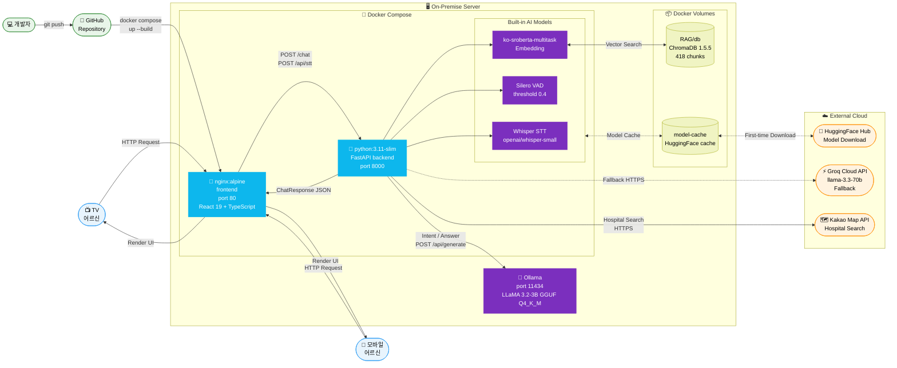
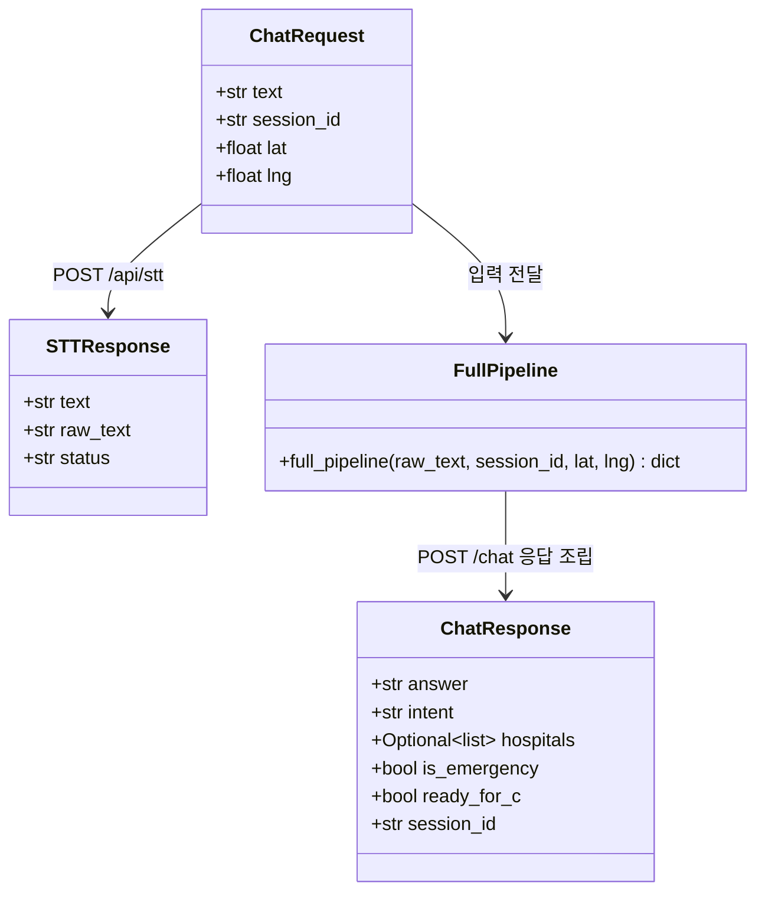
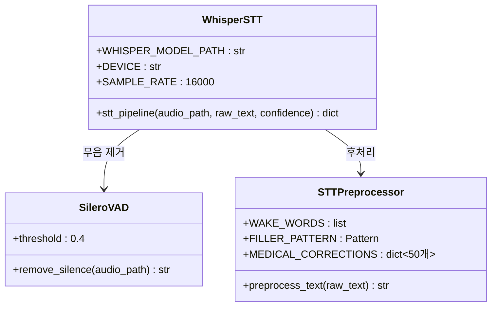
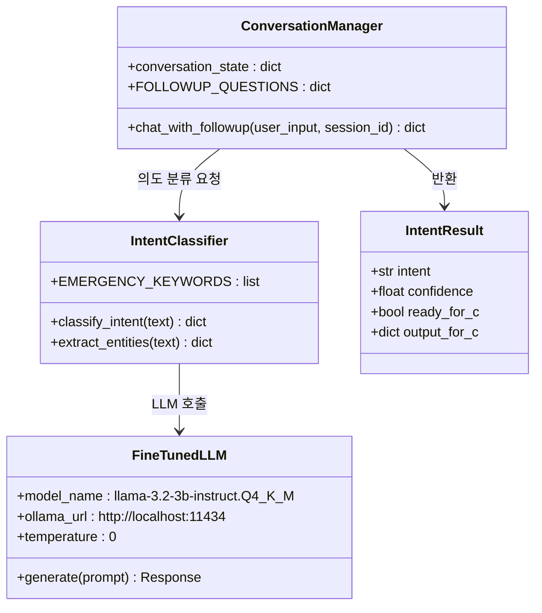
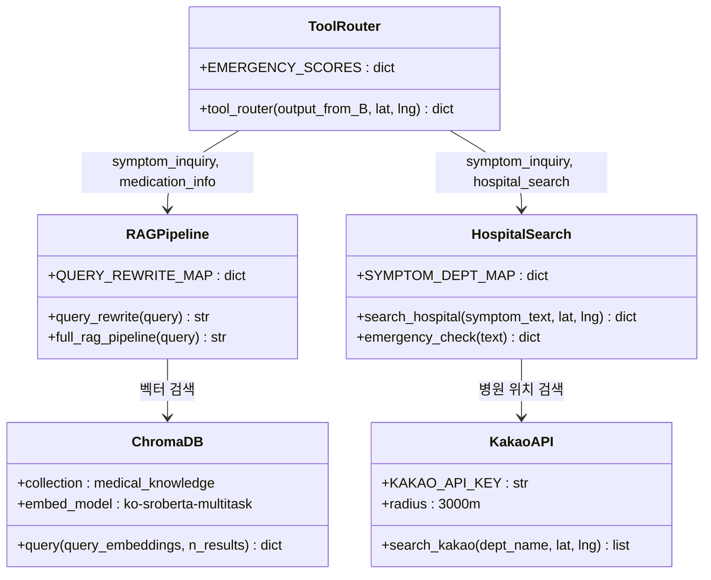
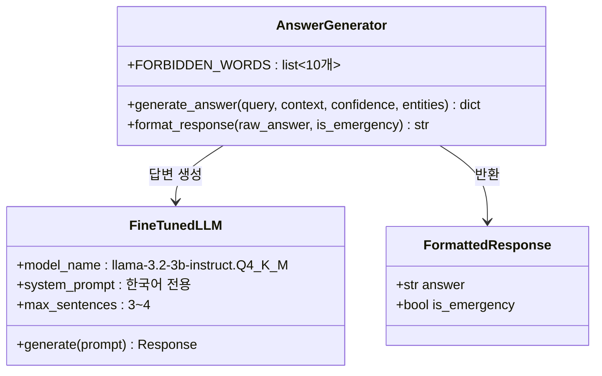
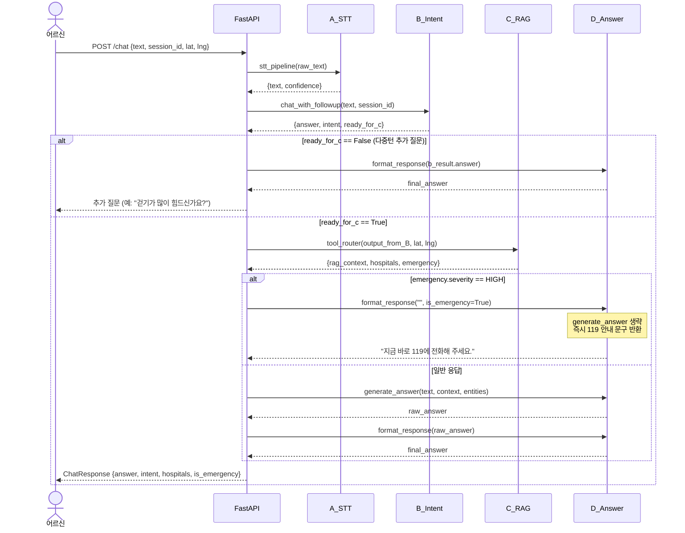
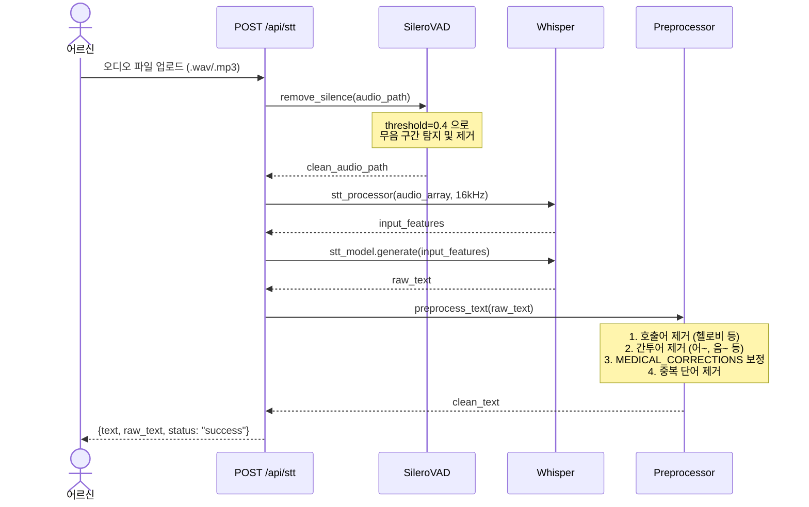
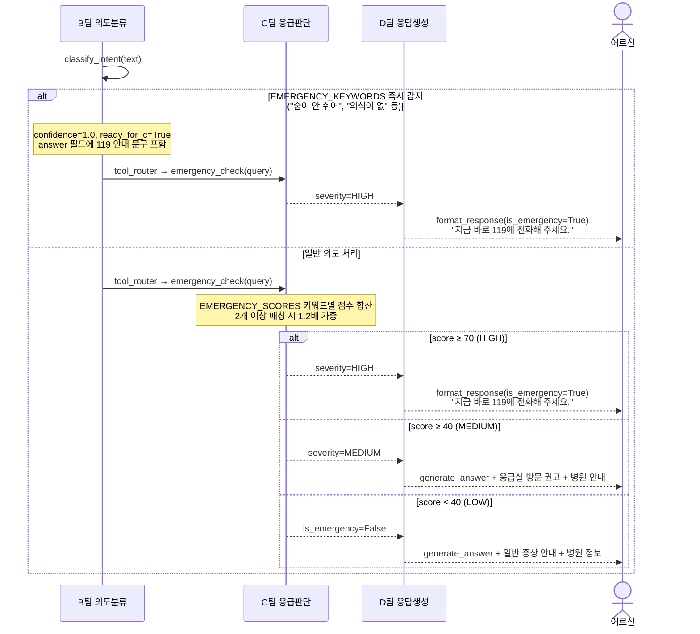

# LG HelloDoctor — 아키텍처 다이어그램

## 목차
0. [시스템 아키텍처](#0-시스템-아키텍처)
1. [클래스 다이어그램](#클래스-다이어그램)
   - [FastAPI 스키마](#1-fastapi-스키마)
   - [A팀 STT 모듈](#2-a팀-stt-모듈)
   - [B팀 의도 분류 모듈](#3-b팀-의도-분류-모듈)
   - [C팀 RAG-병원검색 모듈](#4-c팀-rag--병원검색-모듈)
   - [D팀 응답생성 모듈](#5-d팀-응답생성-모듈)
2. [시퀀스 다이어그램](#시퀀스-다이어그램)
   - [전체 채팅 파이프라인](#1-전체-채팅-파이프라인-a→b→c→d)
   - [STT 처리 흐름](#2-stt-처리-흐름)
   - [응급 감지 분기 흐름](#3-응급-감지-분기-흐름)

---

## 0. 시스템 아키텍처

---

## 클래스 다이어그램

### 1. FastAPI 스키마

---

### 2. A팀 STT 모듈

---

### 3. B팀 의도 분류 모듈

---

### 4. C팀 RAG + 병원검색 모듈

---

### 5. D팀 응답생성 모듈

---

## 시퀀스 다이어그램

### 1. 전체 채팅 파이프라인 (A→B→C→D)

---

### 2. STT 처리 흐름

---

### 3. 응급 감지 분기 흐름

